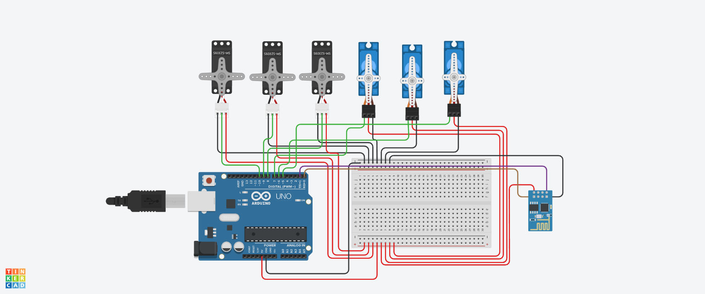
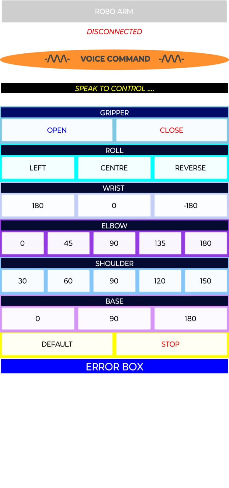

# Robotic-Arm-with-Bluetooth-and-Voice-Control

This is my second-year mini project, a 6-axis Bluetooth-controlled robotic arm developed using an Arduino Uno and a custom mobile app built with MIT App Inventor. The arm can be operated using voice commands and button inputs after connecting to a mobile device via an HC-05 Bluetooth module. It also features voice response capabilities, adding an interactive element. This innovative project earned me the first position in the second-year project presentation!

## Features

- Bluetooth connectivity for wireless control with a mobile device.
- Voice command support (e.g., "Elbow at 45 degrees") using speech recognition.
- Manual control via app buttons for actions like opening/closing the gripper or rotating joints.
- Real-time voice feedback for user confirmation.
- Status updates displayed on the app interface.
- 6-axis movement for precise control and flexibility.

## Components Used
- 3 MG995 servos (used at the base and lower sections for stability and strength)
- 3 SG90 servos (employed in the upper parts for finer movements)
- Arduino Uno
- Power supply
- HC-05 Bluetooth module

## Technologies Used
- Arduino (with .ino sketch)
- MIT App Inventor (for mobile app development)
- HC-05 Bluetooth module
- Servo motors (MG995 and SG90)
- Basic electronics (breadboard, jumper wires, power supply)

## How It Works
The Arduino sketch interprets commands sent via Bluetooth from the mobile app. The app, created with MIT App Inventor, allows users to connect to the HC-05 module, select a device, and control the arm using voice or button inputs. The arm’s servos move to predefined angles based on the commands, with voice responses provided through the app. The MG995 servos handle the base and lower joints, while SG90 servos manage the upper joints for detailed control.

## Installation and Usage
- Clone the repository: `git clone https://github.com/Harshit-yadav-09/Robotic-Arm-with-Bluetooth-and-Voice-Control.git`
- Upload the `.ino` file (`Bluetooth_Robotic_Arm.ino`) to your Arduino board using the Arduino IDE.
- Pair the HC-05 Bluetooth module with your phone and install the app (build the .aia file with MIT App Inventor if included).
- Connect and start controlling the arm via the app!

## Code Structure
The main file, `Bluetooth_Robotic_Arm.ino`, contains the Arduino sketch with a switch-case structure to handle different commands (e.g., 'A' for open gripper, 'H' for elbow at 0 degrees). Comments are included for clarity.

## Screenshots

*Wiring setup showing Arduino Uno, HC-05 Bluetooth module, and servo motors.*

*The MIT App Inventor app interface with voice command and button controls.*

*The 3D wireframe design of the 6-axis robotic arm.*

## Future Improvements
- Add more voice commands for enhanced functionality.
- Improve the app’s user interface for better usability.
- Integrate a web control panel using my MERN stack skills from Apna College.

## Contributing or Contact
Feel free to fork this repository, suggest improvements, or reach out to me at [harshityadav09094@gmail.com](mailto:harshityadav09094@gmail.com) for feedback or collaboration. I’m open to internship or job opportunities – let’s connect!
